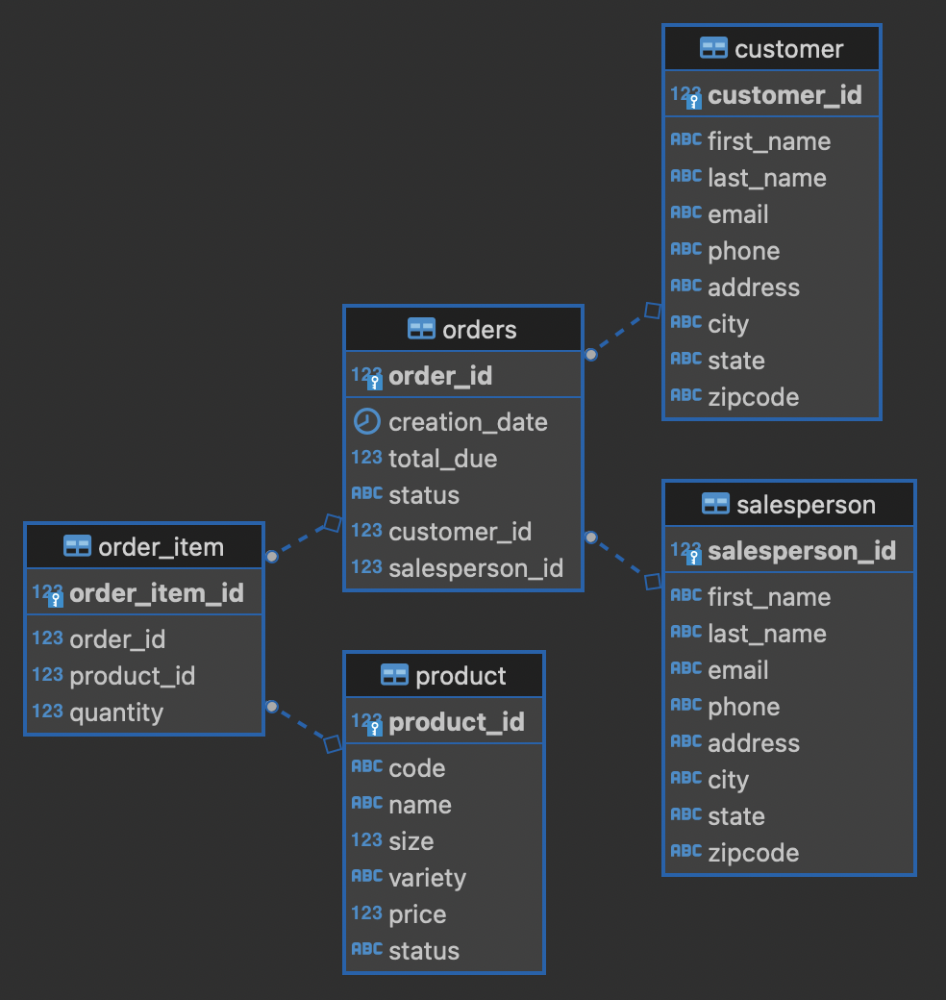

# Java Database Connectivity

## Introduction
This project is focused on the implementation of JDBC. This took the form of CustomerDAO and helped to solidify java database connectivity. A database by the name of hplussports was created in a dockerized psql instance to track all related data. The structure of this database can be seen in the implementation section of this README. The classes used to implement this project are CustomerDAO which extends the DataAccessObject, Customer which creates an object for the customer information to go into, and the DatabaseConnectionManager which manages the connection to the database.

## Implementation
### ER Diagram

### Design Patterns
The two design patterns used were the DAO and the Repository design pattern. The DAO design pattern helps to keep an abstraction layer between the JDBC and the business layer transactions. In this project, and commonly in other projects, the DAO was used in tandem with a DTO. The DTO is an object that encapsulates data for use elsewhere in the system. The Repository design pattern focuses on single table access. The main concept for this pattern is to take all data from the table and join it together in the code rather than with the database. This pattern allows for database sharding which can enable more complicated joins.

## Test
Because of the scope of this project, the only testing method used was by way of the JDBCExecutor main method. As more features were added to the peripheral classes, the output was manually asserted by checking the database that was accessed / modified. DBeaver acted as the client that allowed for database access.